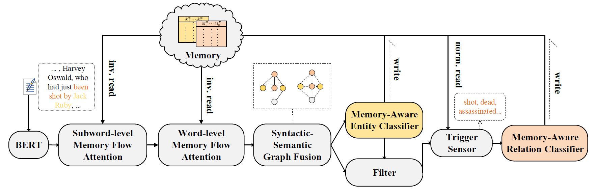

# README
Code for TriMF: "A Trigger-Sense Memory Flow Framework for Joint Entity and Relation Extraction". accepted at WWW 2021. For details of the model and experiments, please see [our paper](https://dl.acm.org/doi/10.1145/3442381.3449895).



## Setup
### Requirements

```bash
pip install -r requirements.txt
```

### Datasets

We use the [DyGIE](https://arxiv.org/pdf/1904.03296.pdf) and [SpERT](https://arxiv.org/pdf/1909.07755.pdf) scripts to pre-process the datasets, see and follow their README: [DyGIE](https://github.com/luanyi/DyGIE/tree/master/preprocessing) and [SpERT](https://github.com/markus-eberts/spert.git).

Dataset format:

```json
[
    {
        "tokens": ["allan", "chernoff", "live", "from", "the", "new", "york", "stock", "exchange", "with", "more", "."], 
        "entities": [{"type": "PER", "start": 0, "end": 2}, {"type": "FAC", "start": 5, "end": 9}], 
        "relations": [{"type": "PHYS", "head": 0, "tail": 1}], "orig_id": "CNN_ENG_20030530_130025.12-4", 
        "dependency": [{"tail": 0, "head": 1, "type": "nsubj"}, {"tail": 1, "head": 1, "type": "ROOT"}, {"tail": 2, "head": 1, "type": "advmod"}, {"tail": 3, "head": 2, "type": "prep"}, {"tail": 4, "head": 8, "type": "det"}, {"tail": 5, "head": 8, "type": "amod"}, {"tail": 6, "head": 7, "type": "compound"}, {"tail": 7, "head": 8, "type": "compound"}, {"tail": 8, "head": 3, "type": "pobj"}, {"tail": 9, "head": 1, "type": "prep"}, {"tail": 10, "head": 9, "type": "pobj"}, {"tail": 11, "head": 1, "type": "punct"}], 
        "ltokens": ["aol", "time", "warner", "and", "microsoft", "are", "burying", "the", "hatchet", "."], 
        "rtokens": ["bring", "us", "up", "to", "speed", "."]
    }
]
```

## Examples

Train:

After pre-processing the data, save the datasets under `data`, and run:

```
python trimf.py train --config configs/example.conf
```

Evaluate:

Download checkpoints from this [link](https://drive.google.com/drive/folders/140PqTY417t3wpUYa3Yj-taGsorH5VChV?usp=sharing), and save in the `data` folder, and run:

```
python trimf.py eval --config configs/batch_eval.conf
```
## Citation
If you have any questions related to the code or the paper, feel free to email `syl@zju.edu.cn`.

```bibtex

@inproceedings{10.1145/3442381.3449895,
author = {Shen, Yongliang and Ma, Xinyin and Tang, Yechun and Lu, Weiming},
title = {A Trigger-Sense Memory Flow Framework for Joint Entity and Relation Extraction},
year = {2021},
isbn = {9781450383127},
publisher = {Association for Computing Machinery},
address = {New York, NY, USA},
url = {https://doi.org/10.1145/3442381.3449895},
doi = {10.1145/3442381.3449895},
booktitle = {Proceedings of the Web Conference 2021},
pages = {1704–1715},
numpages = {12},
location = {Ljubljana, Slovenia},
series = {WWW '21}
}

```

## Acknowledgement

DyGIE from https://github.com/luanyi/DyGIE

SpERT from https://github.com/markus-eberts/spert.git

SciBERT from https://github.com/allenai/scibert
